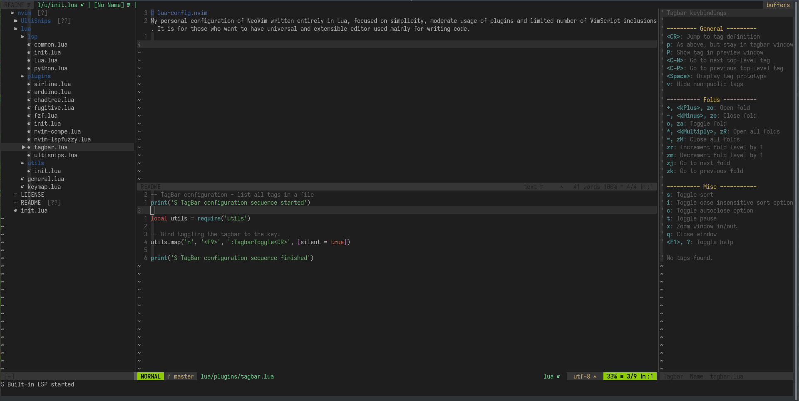

# lua-config.nvim
My personal configuration of NeoVim written entirely in Lua, focused on simplicity, moderate usage of plugins and limited number of VimScript inclusions. It is for those who want to have universal and extensible editor used mainly for writing code.

## Images

